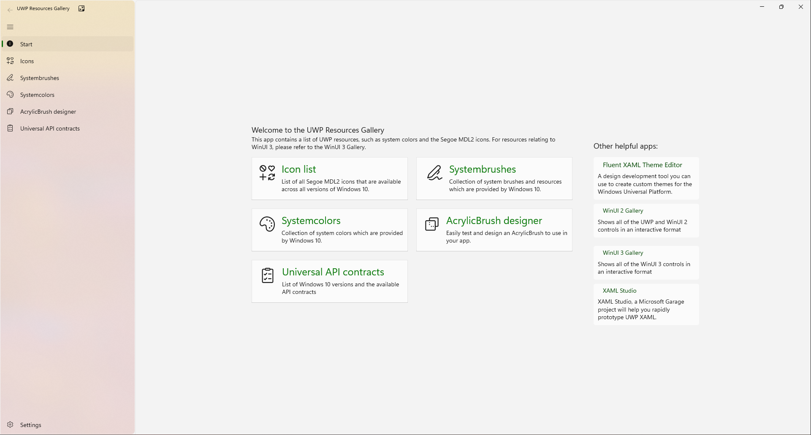
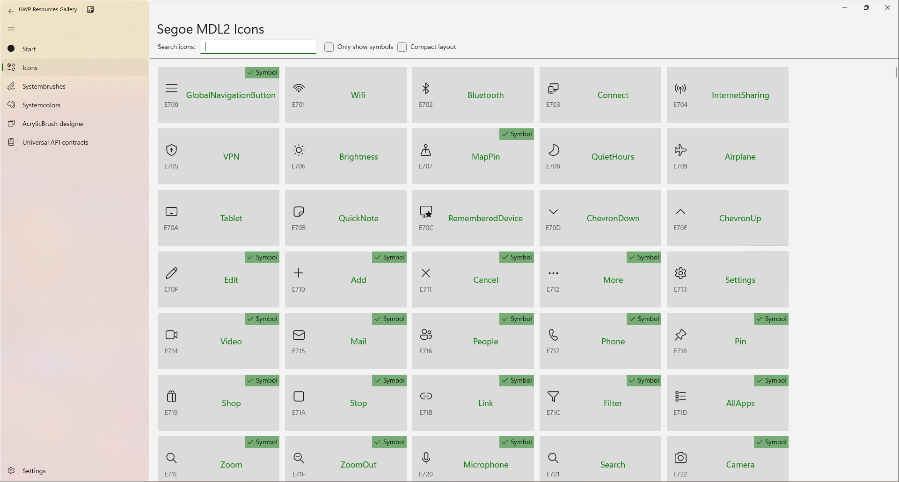
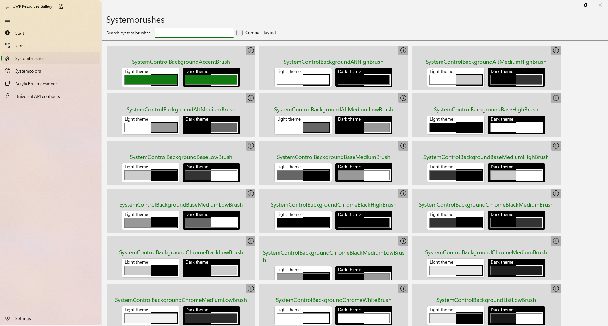
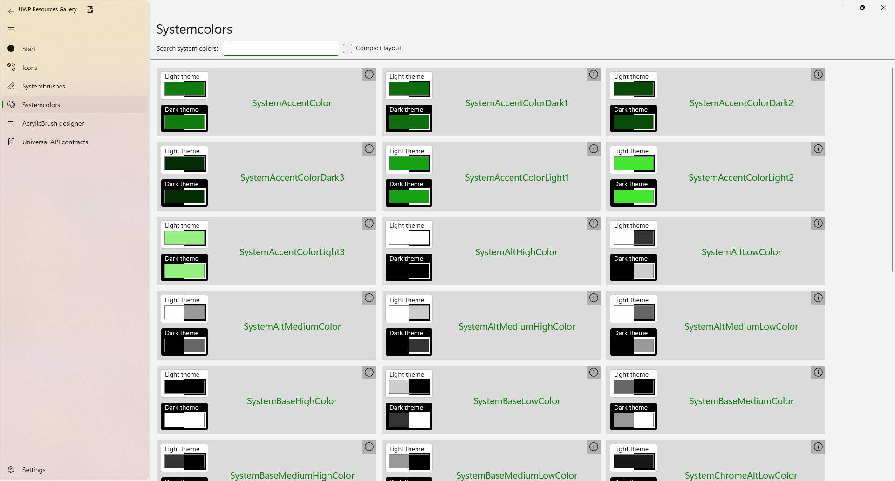
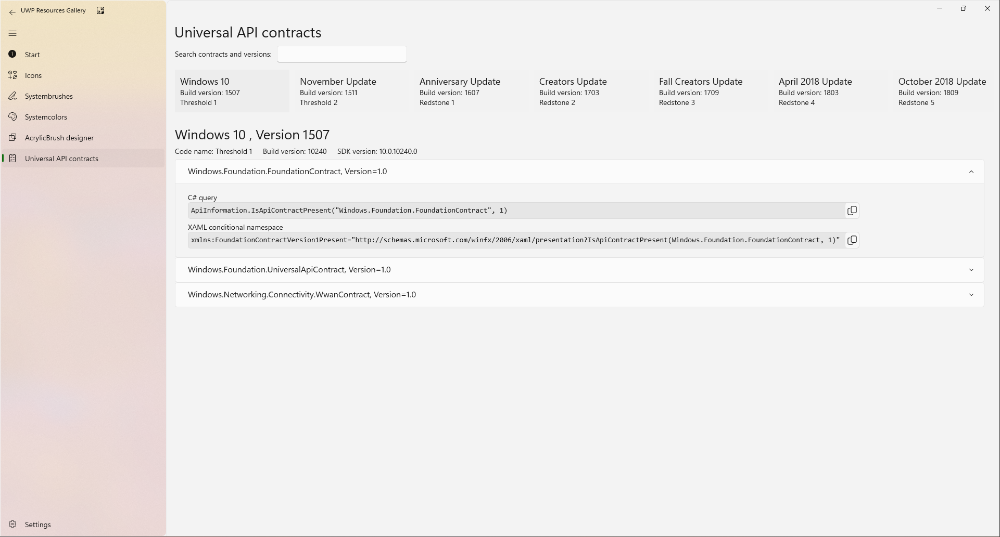

# UWP Resources Gallery

This app shows resources provided by Windows 10 to UWP apps, such as the Segoe MDL2 icons and system colors.

You can download the UWP Resources Gallery now [from the Microsoft Store](https://www.microsoft.com/p/uwp-resources-gallery/9pjjl433vx9r?rtc=1).

The idea for this app is based on the XAML Controls Gallery. The XAML Controls Gallery can be found here: https://github.com/microsoft/Xaml-Controls-Gallery

## The UWP Resources Gallery shows:
 * All Segoe MDL2 icons that are provided by Windows 10
 * How to use Segoe MDL2 icons
 * System colors and brushes that are available to UWP apps
 * List of Windows 10 versions and all available Universal API contracts available

## Building the app
**Note**: The UWP Resources Gallery requires Visual Studio [2017](http://go.microsoft.com/fwlink/?LinkID=532422) or [2019](https://visualstudio.microsoft.com/vs/) to build and Windows 10 to execute.

To obtain information about Windows 10 development, go to the [Windows Dev Center](https://developer.microsoft.com/windows)

To obtain information about Microsoft Visual Studio and the tools for developing Windows apps, go to [Visual Studio](http://go.microsoft.com/fwlink/?LinkID=532422)

## Screenshots

### Iconspage

### Systembrushes page

### Systemcolors page

### Universal API Contracts page

## References:

Official UWP documentation: https://docs.microsoft.com/en-us/windows/uwp/

List of Segoe MDL2 icons in the UWP documentation: https://docs.microsoft.com/en-us/windows/uwp/design/style/segoe-ui-symbol-font

List of system colors in the UWP documentation: https://docs.microsoft.com/en-us/windows/uwp/design/controls-and-patterns/xaml-theme-resources
